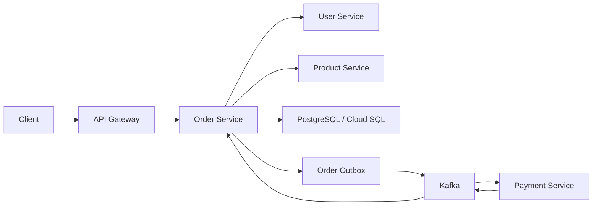

# Order Service

The Order Service is one of the most important repos in the entire ecommerce platform. It owns order creation and retrieval, coordinates validation with downstream services, persists transactional order state, produces outbox events, participates in the saga flow, and consumes payment result events with idempotent handling.

From a system design and interview point of view, this repo is one of the strongest parts of the project because it combines synchronous validation, asynchronous messaging, transactional persistence, resilience patterns, and distributed consistency.

## What This Service Owns

- Order creation
- Order retrieval
- Downstream user/product validation before order placement
- Transactional persistence of order data
- Outbox event creation
- Kafka publishing through an outbox publisher
- Payment result consumption
- Idempotent event handling
- Retry, DLQ, and resilience-aware integrations

## Service Identity

| Item | Value |
| --- | --- |
| Spring application name | `order-service` |
| Default application port | `8083` |
| Public API base path | `/api/v1/orders` |
| Primary database | PostgreSQL / Cloud SQL |
| Messaging backbone | Kafka |

## How This Repo Connects To The Rest Of The System

- Receives client requests through **API Gateway**
- Loads runtime config from **Config Server**
- Registers itself in **Discovery Server**
- Calls **User Service** for user validation
- Calls **Product Service** for product validation
- Publishes domain events consumed by **Payment Service**
- Consumes payment result events from **Payment Service**

## Main Public Responsibilities

- Create new orders
- Get order by ID
- Get orders for the current user

## End-To-End Order Flow



## End-To-End Flow In This Repo

This repo contains the most complete synchronous plus asynchronous business flow in the platform.

### Step-by-step order creation flow

1. Client sends `POST /api/v1/orders` through the gateway
2. Gateway routes the request to `order-service`
3. Order Service validates the user through `user-service`
4. Order Service validates the product through `product-service`
5. Order Service creates the order in PostgreSQL / Cloud SQL
6. In the same transaction, it writes an outbox event
7. Synchronous response is returned to the client
8. A separate publisher reads the outbox row and publishes `order.created` to Kafka
9. `payment-service` consumes the event and processes payment
10. `payment-service` publishes `payment.processed` or `payment.failed`
11. This repo consumes the payment result
12. Order status is updated to the correct final state

### Step-by-step order read flow

1. Client calls order read APIs through the gateway
2. Gateway routes the request here
3. Order Service queries its own order database
4. Response is returned to the client

### Why this section matters

If someone wants to understand the real heart of the system, this is the end-to-end flow to study first.

## Core Architecture Inside This Repo

### 1. Synchronous Validation
Before an order is persisted, the service validates:

- whether the user is valid
- whether the product is valid / available

These calls are handled through load-balanced internal communication.

### 2. Transactional Order Persistence
Order data is stored in PostgreSQL / Cloud SQL.

### 3. Outbox Pattern
The service does not rely on a fragile direct "save DB and immediately trust broker success" approach.

Instead:

- order row is stored
- outbox row is stored
- separate publisher later reads outbox rows and publishes to Kafka

This is the most important consistency pattern in this repo.

### 4. Saga Participation
The service creates the order and emits an event.
Payment processing happens asynchronously in another service.
The order is then finalized based on payment success or failure.

### 5. Idempotency
Duplicate payment result events are handled safely.

### 6. Retry / DLQ / Resilience
The service includes retry, DLQ, and circuit-breaker-style behavior to make distributed communication safer.

## Important Source Files

- `src/main/java/dev/ankit/platform/order_service/controller/OrderController.java`
  - Public order APIs.
- `src/main/java/dev/ankit/platform/order_service/services/OrderService.java`
  - Core order creation flow and transactional logic.
- `src/main/java/dev/ankit/platform/order_service/services/outbox/OutboxPublisher.java`
  - Reads pending outbox rows and publishes to Kafka.
- `src/main/java/dev/ankit/platform/order_service/services/outbox/PaymentResultListener.java`
  - Consumes payment success/failure events.
- `src/main/java/dev/ankit/platform/order_service/services/IdempotencyService.java`
  - Prevents duplicate event reprocessing.
- `src/main/java/dev/ankit/platform/order_service/services/DownstreamValidationService.java`
  - Handles user/product validation with resilience patterns.
- `src/main/java/dev/ankit/platform/order_service/config/KafkaErrorHandlingConfig.java`
  - Retry and DLQ configuration.

## Database Notes

This service manages some of the most interesting persistence structures in the platform:

- `orders`
- outbox/event tables
- processed-event tracking for idempotency

This makes it a strong interview repo because it shows more than simple CRUD.

## Real Learning From This Project

This repo is where some of the strongest system-design concepts moved from theory to implementation:

- Outbox pattern
- Saga coordination
- Idempotency
- Retry and dead-letter handling
- Downstream resilience

One important interview-quality nuance:

> The design intention is to mark outbox events as published only after broker success is confirmed. That is the stricter production-grade pattern and is the natural hardening step for this flow.

## What This Repo Demonstrates In System Design Terms

- Distributed transaction alternative through saga
- Outbox pattern
- At-least-once event-driven processing
- Idempotent consumer handling
- Sync + async hybrid workflow
- Resilience-aware downstream dependency handling

## Dependencies Before Startup

Before starting this repo locally, these should already be available:

- `config-server`
- `discovery-server`
- PostgreSQL
- Kafka
- `user-service`
- `product-service`

Optional but useful for full public flow:

- `api-gateway`
- `payment-service` for full saga completion

Recommended startup order:

1. `config-server`
2. `discovery-server`
3. PostgreSQL and Kafka
4. `user-service`
5. `product-service`
6. `order-service`
7. `payment-service`
8. `api-gateway`

## How To Run This Repo

From the repo root:

```powershell
.\mvnw.cmd spring-boot:run
```

Or package and run:

```powershell
.\mvnw.cmd clean package
java -jar target\order-service-*.jar
```

Default local URL:

```text
http://localhost:8083
```

## Sample API Calls

Create order example:

```powershell
Invoke-RestMethod -Method Post http://localhost:8083/api/v1/orders `
  -ContentType "application/json" `
  -Body '{"productId":"<product-id>","quantity":1}'
```

Get order by id:

```powershell
Invoke-RestMethod http://localhost:8083/api/v1/orders/<order-id>
```

Health check:

```powershell
Invoke-RestMethod http://localhost:8083/actuator/health
```

## Common Failure Cases And Debugging

### 1. Order create API fails

Possible reasons:

- user validation failed
- product validation failed
- PostgreSQL connectivity issue
- downstream service unavailable

What to check:

1. inspect `order-service` logs first
2. verify `user-service` and `product-service` are reachable
3. confirm database connectivity
4. verify request payload correctness

### 2. Order saved but payment flow does not continue

Possible reasons:

- outbox row not created
- publisher not running correctly
- Kafka unavailable
- payment-service not consuming

What to check:

1. inspect outbox table
2. inspect outbox publisher logs
3. verify Kafka is up
4. inspect `payment-service` consumer logs

### 3. Payment result consumed twice or duplicate side effects appear

Possible reason:

- duplicate event delivery in an at-least-once system

What to check:

1. inspect idempotency handling
2. verify processed-event tracking
3. confirm duplicate events are ignored as expected

### 4. Kafka topic issue

Possible reasons:

- broker unavailable
- topic missing
- consumer group not progressing

What to check:

1. verify Kafka broker health
2. list available topics
3. inspect consumer logs and retry/DLQ behavior

## Interview Notes

If asked why this service is special:

> This service is where the system moves beyond basic CRUD. It combines synchronous validation, transactional persistence, asynchronous messaging, and eventual consistency in one business-critical flow.

If asked what pattern stands out most:

> The strongest design pattern here is the outbox plus saga combination, because it allows reliable business progression without trying to use a distributed ACID transaction across services.

## Quick Summary

- This repo is the transactional orchestration center of the business flow.
- It owns order truth, outbox events, and payment-result handling.
- It is one of the best repos to discuss in a lead-level system design interview.
